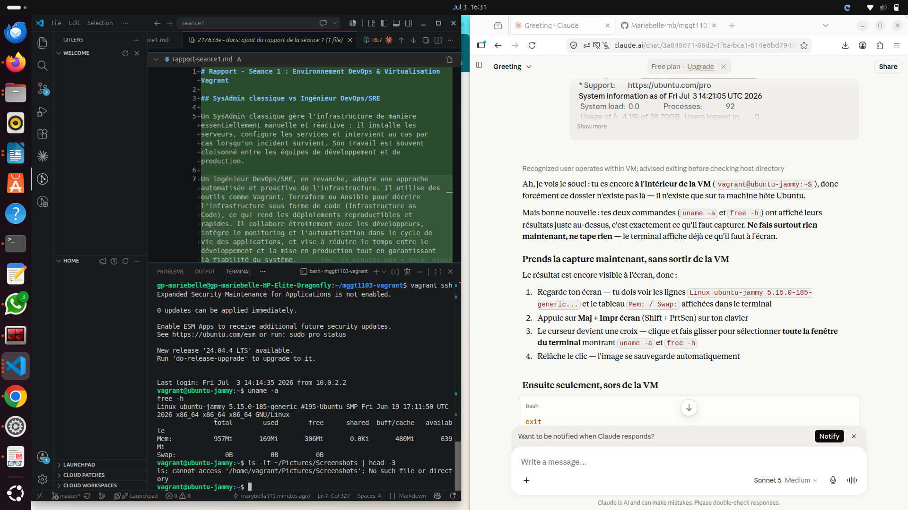

# Rapport - Séance 1 : Environnement DevOps & Virtualisation Vagrant

## SysAdmin classique vs Ingénieur DevOps/SRE

Un SysAdmin classique gère l'infrastructure de manière essentiellement manuelle et réactive : il installe les serveurs, configure les services et intervient au cas par cas lorsqu'un incident survient. Son travail est souvent cloisonné entre les équipes de développement et de production.

Un ingénieur DevOps/SRE, en revanche, adopte une approche automatisée et proactive de l'infrastructure. Il utilise des outils comme Vagrant, Terraform ou Ansible pour décrire l'infrastructure sous forme de code (Infrastructure as Code), ce qui rend les déploiements reproductibles et rapides. Il collabore étroitement avec les développeurs, intègre le monitoring et l'automatisation dans le cycle de vie des applications, et vise à réduire le temps entre le développement et la mise en production tout en garantissant la fiabilité du système.

## Captures d'écran

