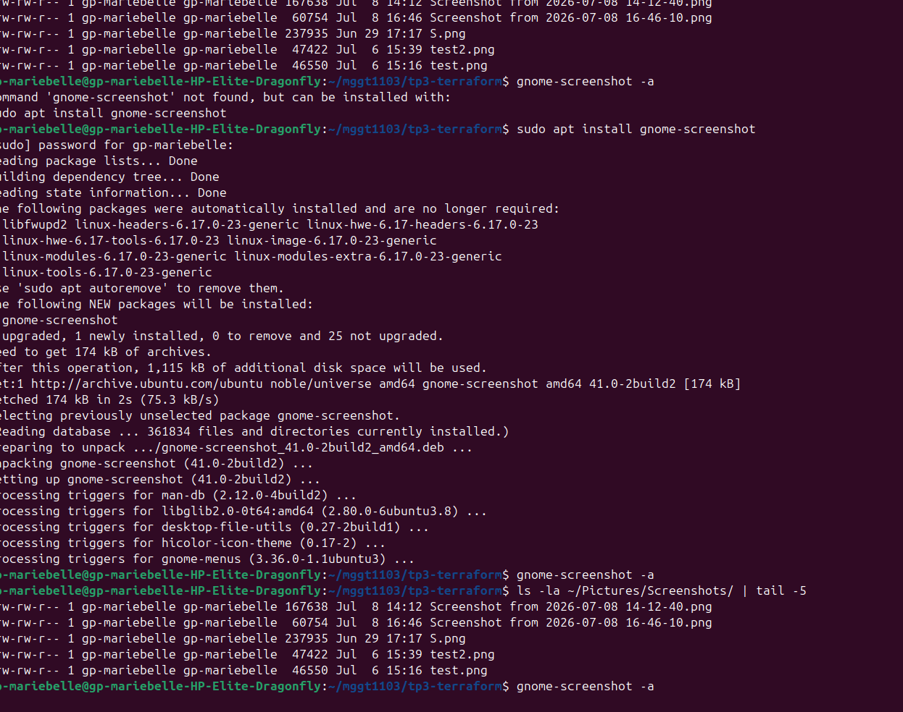

# Rapport - Séance 3 : Infrastructure-as-Code avec Terraform

## Déclaratif vs Impératif

L'approche déclarative, utilisée par Terraform, consiste à décrire l'état final souhaité de l'infrastructure (par exemple : "je veux un fichier avec tel contenu"), sans préciser les étapes pour y arriver — c'est l'outil qui se charge de calculer les actions nécessaires. L'approche impérative, à l'inverse, consiste à écrire une suite précise d'instructions (comme un script bash) qui exécute chaque étape dans l'ordre pour atteindre le résultat. Avec le déclaratif, on peut relancer le même code plusieurs fois sans risque : Terraform compare l'état actuel à l'état désiré et n'applique que les changements nécessaires (idempotence), alors qu'un script impératif peut produire des effets différents ou des erreurs s'il est exécuté plusieurs fois.

## Résultat de terraform apply

Commande exécutée :
cat /tmp/dns_config.txt

Résultat :
nameserver 192.168.56.100
nameserver 8.8.8.8

## Danger d'exposer terraform.tfstate publiquement

Le fichier terraform.tfstate contient une cartographie complète de l'infrastructure réellement déployée, incluant souvent des informations sensibles en clair : adresses IP internes, identifiants de ressources, et parfois même des secrets ou mots de passe générés par certains providers (clés API, mots de passe de bases de données, certificats). Si ce fichier est poussé sur un dépôt public, n'importe qui peut consulter ces informations et obtenir une cartographie précise de l'infrastructure réelle d'une organisation, facilitant une attaque ciblée. C'est pourquoi il doit systématiquement être exclu du contrôle de version via .gitignore, et idéalement stocké de manière chiffrée dans un backend distant sécurisé (comme un bucket S3 chiffré avec verrouillage d'état).
